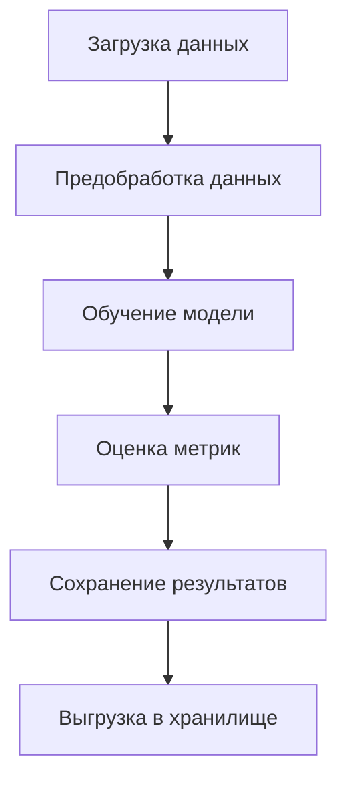
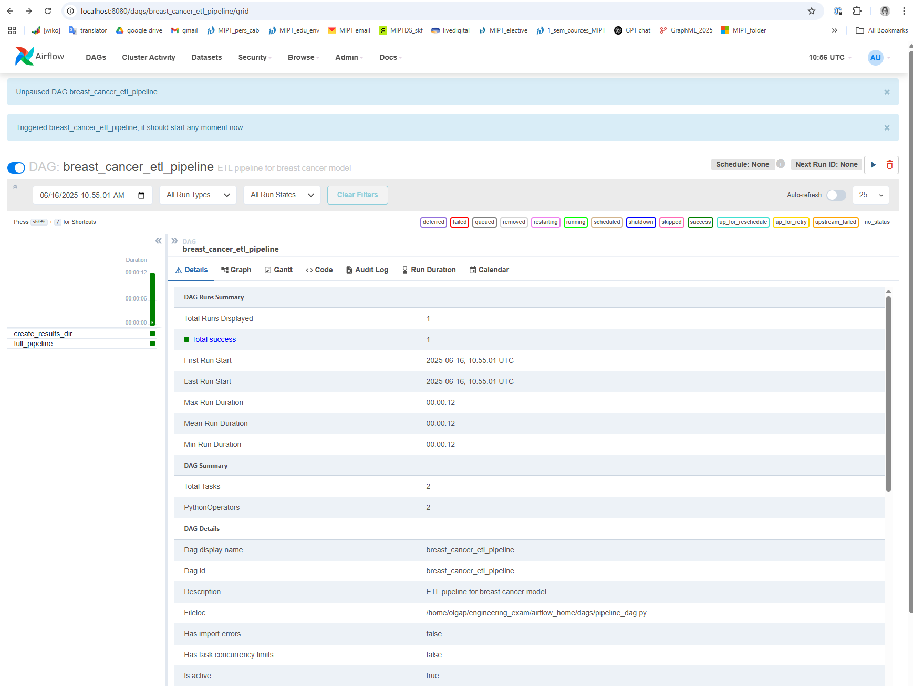
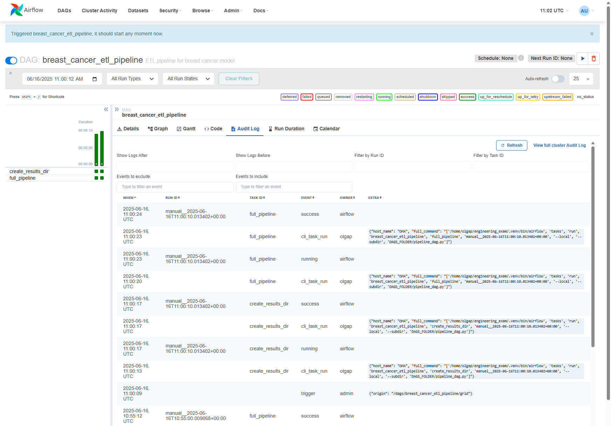
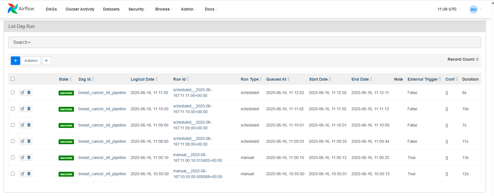

# Automated Machine Learning Pipeline for Breast Cancer Diagnosis
**Оркестрация ETL и обучение модели с помощью Apache Airflow и Python**

## Оглавление
- [Цель проекта](#цель-проекта)
- [Архитектура и схема пайплайна](#архитектура-и-схема-пайплайна)
- [Описание этапов пайплайна](#описание-этапов-пайплайна)
- [Инструкция по запуску](#инструкция-по-запуску)
- [Интеграция с хранилищем](#интеграция-с-хранилищем)
- [Анализ ошибок и устойчивости](#анализ-ошибок-и-устойчивости)
- [Идеи и предложения по развитию](#идеи-и-предложения-по-развитию)
- [Скриншоты](#скриншоты)

---

## Цель проекта

Разработка автоматизированного, воспроизводимого и масштабируемого пайплайна для обработки медицинских данных (Breast Cancer Wisconsin Diagnostic), построения и оценки модели машинного обучения (логистическая регрессия) для диагностики заболеваний, а также сохранения результатов на локальный диск или облачное хранилище.  
Оркестрация процесса реализована с помощью Apache Airflow.

---

## Архитектура и схема пайплайна

**ML-задача:**  
Классификация опухолей молочной железы на доброкачественные и злокачественные по данным медицинских обследований.

**Структура пайплайна:**



---

## Описание этапов пайплайна

**Модули (папка `etl/`):**

- `load_data.py`: Загрузка данных из исходного CSV, первичный анализ структуры.
- `preprocess_data.py`: Очистка, нормализация, обработка пропусков, разделение на train/test, сохранение scaler.
- `train_model.py`: Обучение модели LogisticRegression, сохранение обученной модели.
- `evaluate_model.py`: Оценка Accuracy, Precision, Recall, F1; сохранение метрик в JSON.
- `save_results.py`: Проверка/создание папки results для артефактов.
- `upload_results.py`: (опционально) Загрузка артефактов в облако или на локальный диск

**DAG (папка `dags/`):**

- `pipeline_dag.py`: Определяет DAG и связи между задачами. Каждый шаг реализован как отдельный `PythonOperator`.

**Зависимости DAG:**

- Сначала создается папка results (`ensure_results_dir`).
- Затем весь ETL/ML пайплайн (`full_pipeline`).
- По завершении — выгрузка результатов (`upload_results`).

---

## Инструкция по запуску

1. Копирование данных и кода в WSL

    ```bash
    cp -ru /mnt/c/Users/olgap/OneDrive/MIPT_Master/Engineering_exam/* ~/engineering_exam/
    ```

2. Установка зависимостей

    ```bash
    cd ~/engineering_exam
    python3 -m venv .venv
    source .venv/bin/activate
    pip install --upgrade pip
    pip install -r requirements.txt
    ```

3. Инициализация Airflow и создание пользователя

    ```bash
    export AIRFLOW_HOME=~/engineering_exam/airflow_home
    airflow db migrate
    airflow users create \
        --username admin \
        --firstname Olga \
        --lastname P \
        --role Admin \
        --email olga.poletkina@gmail.com \
        --password admin
    ```

4. Запуск Airflow

    ```bash
    nohup airflow webserver > ~/engineering_exam/webserver.log 2>&1 &
    nohup airflow scheduler > ~/engineering_exam/scheduler.log 2>&1 &
    ```

5. Открыть UI Airflow  
   Перейдите по адресу: http://localhost:8080  
   Логин/пароль: admin / admin

6. Запуск DAG вручную
    - В UI активируйте DAG `breast_cancer_etl_pipeline`.
    - Нажмите «play» для ручного старта.
    - Для CLI-запуска задачи:

    ```bash
    airflow tasks test breast_cancer_etl_pipeline full_pipeline 2024-06-17
    ```

7. Как получить результаты
    - Артефакты сохраняются в:

    ```
    ~/engineering_exam/results/
    ```

    - Для копирования результатов на Windows:

    ```bash
    cp -ru ~/engineering_exam/results/* /mnt/c/Users/olgap/OneDrive/MIPT_Master/Engineering_exam/results/
    ```

---

## Интеграция с хранилищем

- Локальный диск (по умолчанию):  
  Все артефакты и метрики сохраняются в подкаталог `results/`

    ```
    results/
        metrics.json
        model.pkl
        scaler.pkl
    ```

- Возможна интеграция с Google Drive/Dropbox/S3.  
  Параметры авторизации (credentials.json, токен) хранятся в отдельной папке `secrets/` и не коммитятся в репозиторий.  
  Пример кода отправки файла в Google Drive:

    ```python
    from pydrive.auth import GoogleAuth
    from pydrive.drive import GoogleDrive

    gauth = GoogleAuth()
    gauth.LocalWebserverAuth()
    drive = GoogleDrive(gauth)
    file = drive.CreateFile({'title': 'metrics.json'})
    file.SetContentFile('results/metrics.json')
    file.Upload()
    ```

---

## Анализ ошибок и устойчивости

- Потенциальные точки сбоя:  
  Не доступен источник данных → повторные попытки (Airflow retries).  
  Неожиданная структура/пустые значения → предварительная валидация данных, обработка ошибок.  
  Ошибка обучения модели → логирование исключения, артефакты предыдущих запусков не затираются.  
  Ошибка при записи файлов → обработка исключений, создание папки results если не существует.

- Robustness (устойчивость):  
  Все задачи изолированы — сбой в одной не рушит остальные.  
  Используются Airflow retries, логирование и ручной rerun.  
  Возможна ручная отладка каждого скрипта отдельно.  
  Логи доступны в папке logs/ и через UI Airflow.

---

## Идеи и предложения по развитию

- Поддержка нескольких моделей (RandomForest, XGBoost).
- Добавление автоматических тестов для данных и пайплайна.
- Автоматическое оповещение (email/slack) при сбое пайплайна.
- Развёртывание в Docker, CI/CD, использование .env и config.yaml для параметров.
- Интеграция с S3/Minio/Google Drive для хранения артефактов.
- Улучшение визуализации и добавление отчётов по данным.

---

## Скриншоты





---

## Контакты

Автор — Olga Poletkina  
Email: olga.poletkina@gmail.com


